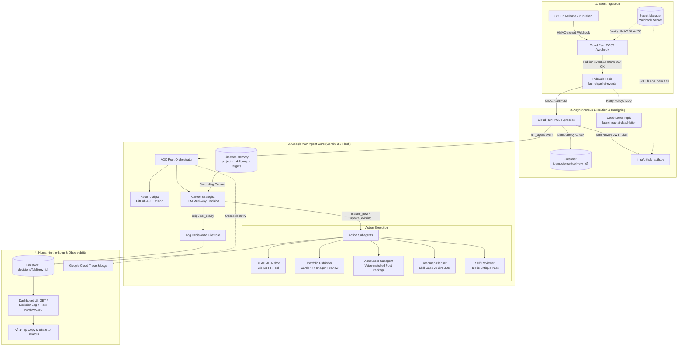

# LaunchPad-AI — Architecture & Technical Design

**All Things Agentic Hackathon · Taskmaster Track**

> **One-sentence pitch:** *An autonomous career agent that manages your hireability — watching what you build on GitHub, maintaining a live model of your skills against the jobs you want, deciding how each project changes your standing, preparing publish-ready materials, and recommending what to build next.*

---

## 1. System Architecture

---

## 2. Decoupled Ingestion & Execution Model

GitHub webhook deliveries require an HTTP response within **10 seconds**; however, multi-step LLM reasoning, code analysis, and PR generation take significantly longer (15–60s).

LaunchPad-AI solves this through a decoupled **Serverless Event-Driven Architecture**:

1. **`POST /webhook` (Ingest Router)**:
   - Reads the raw body and `X-Hub-Signature-256` header.
   - Verifies the HMAC signature using `github-webhook-secret` from **Google Cloud Secret Manager**.
   - Validates the event (`release.published`).
   - Normalizes the payload into the Pub/Sub schema and publishes to `projects/launchpad-ai-506616/topics/launchpad-ai-events`.
   - Returns `200 OK` in < 200ms.

2. **`POST /process` (Worker Seam)**:
   - Invoked asynchronously by Pub/Sub Push Subscription with **OIDC token verification** (`pubsub-invoker@...`).
   - **Idempotency Gate**: Checks Firestore `idempotency/{delivery_id}`. If already processed, acks and stops.
   - **GitHub App Auth**: Generates a short-lived installation access token using the GitHub App's `.pem` key from Secret Manager.
   - Invokes `agent.runner.run_agent(event)` using **Google ADK** and **Gemini 3.5 Flash on Vertex AI**.
   - Saves final decision, artifacts, and execution metrics to Firestore.

---

## 3. Security & IAM Architecture

| Component | Security Mechanism | Implementation |
|:---|:---|:---|
| **Webhook Ingest** | HMAC SHA-256 Signature Verification | Secret stored in **Secret Manager**, verified before payload processing |
| **Pub/Sub Push to Cloud Run** | OIDC Service Account Authentication | Dedicated `pubsub-invoker` service account with `roles/run.invoker` |
| **GitHub App API Access** | RS256 JWT Token Exchange | Private key in Secret Manager, auto-refreshes short-lived tokens (1 hr) |
| **Vertex AI Access** | Workload Identity / Service Account | Uses Vertex AI in `asia-south1` via `GOOGLE_GENAI_USE_VERTEXAI=1` |
| **Fault Tolerance** | Dead-Letter Queue (DLQ) | Failed messages route to `launchpad-ai-dead-letter` after 5 delivery attempts |

---

## 4. Firestore Memory Model

- `projects/{repo}`: Catalog of analyzed repositories (summary, stack, skill tags, portfolio status).
- `skill_map/current`: Live skill scores and recognized gap areas.
- `targets/roles`: Target job profiles, requirements, and reference job descriptions.
- `roadmap/current`: Next recommended project build to close hireability gaps.
- `decisions/{delivery_id}`: Full audit log of agent decisions (`feature_new`, `update_existing`, `not_ready`, `skip`), rationale, self-review results, and generated PR links.
- `voice/profile`: Personal tone guidelines and writing samples for LinkedIn generation.
- `idempotency/{delivery_id}`: Deduplication timestamps ensuring at-most-once execution.

---

## 5. Google Cloud Stack Summary

- **Compute**: Cloud Run (`launchpad-ai` service in `asia-south1`)
- **Reasoning**: Gemini 3.5 Flash via Google GenAI SDK & Vertex AI (`GOOGLE_GENAI_USE_VERTEXAI=1`)
- **Agent Orchestration**: Google Agent Development Kit (ADK)
- **Eventing & Retries**: Google Cloud Pub/Sub with Dead-Letter Policy
- **State & Memory**: Google Cloud Firestore (Native Mode)
- **Secrets Management**: Google Cloud Secret Manager
- **Observability**: OpenTelemetry instrumentation via Google Cloud Trace & Cloud Logging
