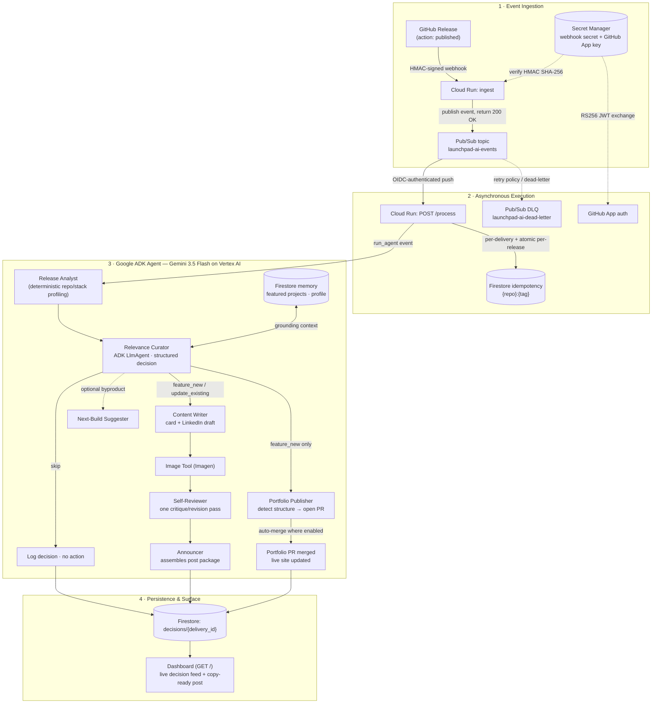

# LaunchPad-AI — Architecture & Technical Design

**All Things Agentic Hackathon · Taskmaster Track**

> **One-sentence pitch:** *An autonomous agent that keeps a developer's portfolio and LinkedIn in sync with what they ship — deciding, on each GitHub release, whether the work is worth featuring as new, folding into an existing entry, or skipping entirely, then acting on that decision.*

---

## 1. System Architecture

The system is event-driven and decoupled: ingestion returns instantly, and the agent does its work asynchronously in the background. Every Google Cloud service is chosen for a specific engineering reason (see §5).

---

## 2. Decoupled ingestion & execution model

Ingestion and processing are split across two Cloud Run entry points connected by Pub/Sub. This is the core architectural decision that makes the agent a genuine background worker:

1. **Ingest** verifies the webhook's HMAC signature (secret from Secret Manager), publishes the event to Pub/Sub, and returns `200 OK` in well under a second. GitHub never waits on the agent.
2. **Pub/Sub** delivers the event to `/process` via an OIDC-authenticated push subscription. Its retry policy and dead-letter queue mean a transient failure is retried or parked, never silently lost.
3. **`/process`** runs the ADK agent pipeline. It is idempotent at two levels: per-delivery (each webhook delivery ID processed once) and per-release (an atomic Firestore `create()` on `{repo}:{tag}` — because GitHub fires multiple webhooks for one release within milliseconds, a non-atomic check-then-write would race).

Each stage in the pipeline has its own error boundary and **fails safe**: if the curator errors, it defaults to `skip` rather than publishing something unreviewed; if an action subagent fails (image, PR, draft), the others still complete. One failure never crashes the run or the webhook.

---

## 3. The agentic core — the Relevance Curator

The heart of the system is a genuine multi-way decision, not a rule table. The Relevance Curator is a **Google ADK `LlmAgent`** running **Gemini 3.5 Flash on Vertex AI** through the ADK Runner, with a Pydantic-schema-constrained structured output. On each release it is given:

- the **release profile** (repo, summary, stack, README) from the Release Analyst,
- the **already-featured projects** (from Firestore memory), and
- the **developer's context/profile**.

It returns one of three actions plus written reasoning:

| Action | Meaning |
|:---|:---|
| `feature_new` | Substantial, not-yet-featured work → new portfolio card + LinkedIn draft |
| `update_existing` | Real new capability on an already-featured project → refreshed announcement, no duplicate |
| `skip` | Trivial / doc-only / WIP → no action |

Because the curator reads what's already featured before deciding, it never duplicates a project across releases — its memory of the developer's public presence is what keeps the portfolio coherent over time.

---

## 4. Firestore memory model

Firestore is the agent's serverless memory and audit log:

- `projects/{repo}` — projects currently featured on the portfolio (what the curator consults to avoid duplicates).
- `context/profile` — the developer's synthesized profile (interests, focus areas), used as decision context; bootstrapped from public GitHub data if absent.
- `config/portfolio` — the target portfolio repo and auto-merge preference.
- `decisions/{delivery_id}` — full audit log of every decision (`feature_new`, `update_existing`, `skip`), its reasoning, self-review outcome, and any generated PR link.
- `idempotency/{...}` — per-delivery and per-release dedupe records.

---

## 5. Google Cloud stack summary

| Service | Role | Why it was the right choice |
|:---|:---|:---|
| **Vertex AI (Gemini 3.5 Flash)** | The decision engine | Service-account auth (no API keys), structured output we can gate real actions on |
| **Google ADK** | Agent orchestration | Clean `LlmAgent` + Runner with schema-constrained output; the curator can't return free-form mush |
| **Cloud Run** | Hosts ingest + agent | Scales to zero between releases, spins up on the webhook — fits a bursty, event-triggered workload with no always-on cost |
| **Cloud Pub/Sub** | Event backbone | Decouples ingest from processing (background execution), with retries + DLQ for failure tolerance |
| **Cloud Firestore** | Memory + audit log | Serverless document store — the "memory layer" needs zero infrastructure |
| **Secret Manager** | Secrets | Webhook secret and GitHub App private key, never in code or env |

---

## 6. Security & IAM

- **Webhook authenticity:** every inbound webhook is verified with HMAC-SHA256 against the secret in Secret Manager before anything is published.
- **GitHub App auth:** the agent authenticates as a GitHub App via an RS256 JWT minted from a private key held in Secret Manager — scoped, revocable, no personal tokens.
- **Internal push auth:** Pub/Sub → `/process` uses an OIDC-authenticated push subscription, so the processing endpoint only accepts events from the topic.
- **Fail-safe default:** any curator failure resolves to `skip`, so an internal error can never cause an unreviewed publish.
